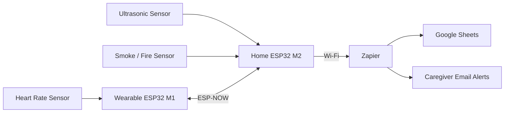

# Assistive Home Controller for Elderly Support

## Overview

This project was developed for the **Pervasive Computing Lab (700.401)** at the University of Klagenfurt.

The goal was to design and implement a low-cost assistive monitoring system for elderly individuals that combines environmental monitoring, health monitoring, and emergency notification capabilities.

The system consists of two ESP32 devices communicating through **ESP-NOW**:

* **Stationary Unit (Home Base)**

  * Smoke / Fire Detection
  * Intrusion Detection using Ultrasonic Sensor
  * Alert Generation

* **Wearable Unit**

  * Heart Rate Monitoring
  * SOS Alert Generation
  * Reception of Environmental Alerts

The project demonstrates end-to-end integration from sensor acquisition to cloud-based notifications.

---

## Features

### Health Monitoring

* Real-time heart-rate monitoring
* Abnormal heartbeat detection
* SOS emergency triggering

### Environmental Monitoring

* Smoke and fire detection
* Intrusion detection
* Threshold-based alert generation

### Wireless Communication

* ESP-NOW peer-to-peer communication
* Bidirectional messaging between devices
* Low-latency communication without router dependency

### Cloud Integration

* HTTP POST communication
* Zapier automation workflow
* Google Sheets data logging
* Automated caregiver email notifications

### Data Visualization

* Historical data storage
* Live dashboards
* Event tracking and analysis

---
## System Architecture

---

## Hardware Components

| Component                 | Purpose                |
| ------------------------- | ---------------------- |
| ESP32                     | Main Controller        |
| Pulse Sensor              | Heart Rate Monitoring  |
| MQ-2 Smoke Sensor         | Smoke / Fire Detection |
| HC-SR04 Ultrasonic Sensor | Intrusion Detection    |
| LEDs / Buzzers            | Local Alerts           |
| Breadboard & Wires        | Prototyping            |

---

## Technologies Used

* ESP32
* Arduino IDE
* ESP-NOW
* Zapier Webhooks
* Google Sheets
* Proteus Simulation

---

## Results

The system successfully demonstrated:

* Real-time heart-rate monitoring
* Environmental hazard detection
* ESP-NOW communication
* Cloud-based logging
* Automated email alerts
* Dashboard visualization

---

## Future Improvements

* Fall Detection using IMU
* Mobile Application
* Voice Assistance
* Secure Encrypted Communication
* Multi-user Support
* AI-based Anomaly Detection

---

## Authors

* Omar Elghandour
* Nesma Shabaan

University of Klagenfurt

Pervasive Computing Lab (700.401)
